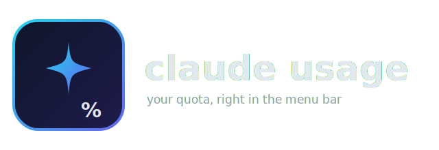

<p align="center">
  
</p>

<p align="center">
  <strong>Your Claude Code quota, live in the menu bar.</strong><br>
  Reads straight from the <code>claude</code> CLI on your machine — no browser cookie, no login, no network calls beyond your own Anthropic account.
</p>

<p align="center">
  
  
  
</p>

---

## What it does

Claude Code already knows your usage — `claude -p "/usage"` prints it. This app just polls that command every 60 seconds and shows the result as three progress bars in your menu bar:

- **Session (5 hour)** — resets on a rolling window
- **Weekly (7 day)** — all models combined
- **Weekly, current model** — just the model you're actively using

Click the menu bar icon, see your bars. That's the whole app.

No cookies, no OAuth flow of its own, no server. It shells out to the `claude` binary you already have installed and authenticated — same source of truth as the CLI's own `/usage` command.

## Install

### Build from source

```bash
git clone https://github.com/djalmaaraujo/claude-code-usage-menubar.git
cd claude-code-usage-menubar/app
./build.sh
```

Compiles, packages `ClaudeUsage.app`, ad-hoc signs it, and opens it. Drag `build/ClaudeUsage.app` into `/Applications` to keep it around.

### Requirements

- macOS 13+
- Xcode Command Line Tools (`xcode-select --install`) — for `swiftc`
- [Claude Code CLI](https://claude.com/claude-code) installed and logged in (`claude` on your `PATH`)

No other dependencies — one Swift file, SwiftUI + AppKit only.

## How it works

```
┌────────────────────────────┐
│  MenuBarExtra (SwiftUI)    │
│                             │
│  every 60s ──► Process ────┼──► claude -p "/usage" --output-format json
│                             │           │
│  regex-parse "result" ◄────┼───────────┘
│  → 3 progress bars          │
└────────────────────────────┘
```

`/usage` is a built-in Claude Code command answered locally by the CLI (no model call, no token cost — `total_cost_usd` and `duration_api_ms` come back `0`). The app just automates typing it every minute and turns the text reply into bars.

## Project layout

| File | Purpose |
|------|---------|
| `app/App.swift` | the entire app — menu bar scene, usage polling, parsing, UI |
| `app/make_icon.swift` | generates the app icon + menu bar glyph (no image assets checked in) |
| `app/Info.plist` | bundle metadata, `LSUIElement` to hide the Dock icon |
| `app/build.sh` | compiles and packages `ClaudeUsage.app` |

## License

MIT © Djalma Araújo
